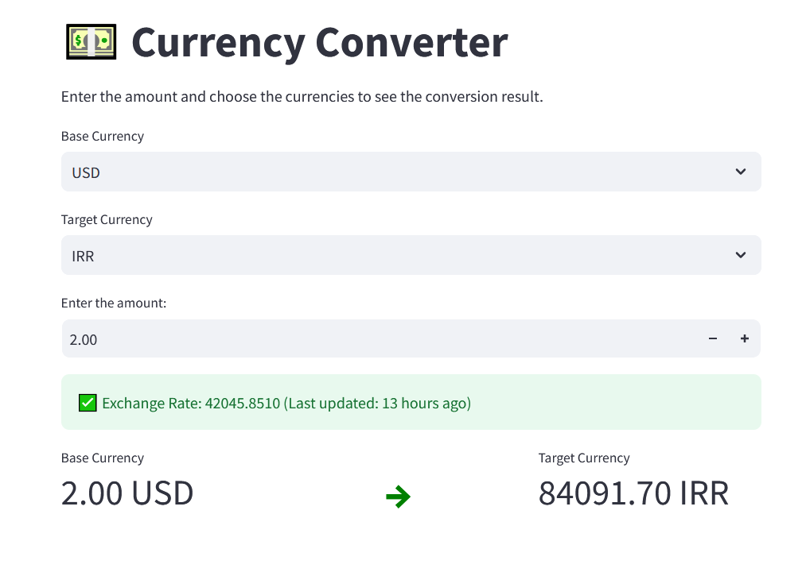

# Currency Converter Application



This project is a simple currency converter that uses real-time exchange rates. It consists of two main components:
1. A Python script (`currency_convertor.py`) for fetching and converting currencies via an external API.
2. A web-based interface built using Streamlit (`app.py`) for users to input currencies and amounts, and view the conversion results.

## Features
- **Real-time exchange rates**: Get updated exchange rates from the [ExchangeRate-API](https://www.exchangerate-api.com/).
- **Caching**: Utilizes caching (TTLCache) to store exchange rates for 12 hours to avoid redundant API calls and improve performance.
- **Web interface**: Built with Streamlit, the web app allows users to select base and target currencies, input the amount, and view the converted result.
- **User-friendly**: The app provides feedback on when the exchange rate was last updated, as well as clear visuals to display the conversion process.

## Project Structure
```
.
├── src                         # Source folder containing all Python files
│   ├── app.py                  # Streamlit web app
│   ├── currency_convertor.py   # Core Python script for currency conversion
│   ├── constants.py            # Currency list for dropdown (not shown)
├── README.md                   # Documentation file
└── requirements.txt            # Python dependencies
```

## Requirements
- Python 3.x
- Internet connection for fetching exchange rates

## Installation

1. **Clone the repository:**
    ```bash
    git clone https://github.com/yourusername/currency-converter.git
    cd currency-converter
    ```

2. **Create a virtual environment (optional but recommended):**
    ```bash
    python -m venv venv
    source venv/bin/activate  # For Windows: venv\Scripts\activate
    ```

3. **Install the required dependencies:**
    ```bash
    pip install -r requirements.txt
    ```

4. **Add your API key to the `currency_convertor.py` file:**
    Replace `cccde48f4320dc1dad4fbef5` in the API URL with your own API key from [ExchangeRate-API](https://www.exchangerate-api.com/).

    ```python
    url = f'https://v6.exchangerate-api.com/v6/YOUR_API_KEY/latest/{base_currency}'
    ```

## Running the Application

1. **Run the Streamlit web app:**
    ```bash
    streamlit run app.py
    ```

2. **Use the currency converter:**
    - The app will open in your default web browser.
    - Select the base currency and target currency from the dropdowns.
    - Input the amount of the base currency you wish to convert.
    - The conversion result and exchange rate information will be displayed.

## Usage (Command Line)

You can also run the currency conversion in the command line without using the web interface:

```bash
python currency_convertor.py
```

You will be prompted to input the base currency, target currency, and amount, and the conversion result will be displayed in the terminal.

## Example

### Web Interface
- Select `IRR` (Iranian Rial) as the base currency.
- Select `USD` (United States Dollar) as the target currency.
- Enter `10000` as the amount.
- The app will display the conversion result, the exchange rate, and the time of the last update.

### Command Line
```
$ python currency_convertor.py
Enter base currency: USD
Enter target currency: EUR
Enter amount of base currency: 100
Converted result: 92.45  # Example result
```

## API Usage & Caching
- The app uses [ExchangeRate-API](https://www.exchangerate-api.com/) to fetch exchange rates.
- Exchange rates are cached for 12 hours using `cachetools` to avoid repeated API calls and improve efficiency.

## Contributing
Feel free to contribute to this project by forking the repository and submitting pull requests.

## License
This project is licensed under the MIT License.

---

## Contact
For any questions or feedback, feel free to reach out to [your_email@example.com](mailto:your_email@example.com).

---

Replace the placeholders such as `"YOUR_API_KEY"` with your actual data and customize it based on your needs.